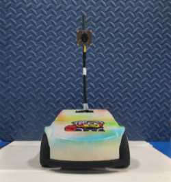
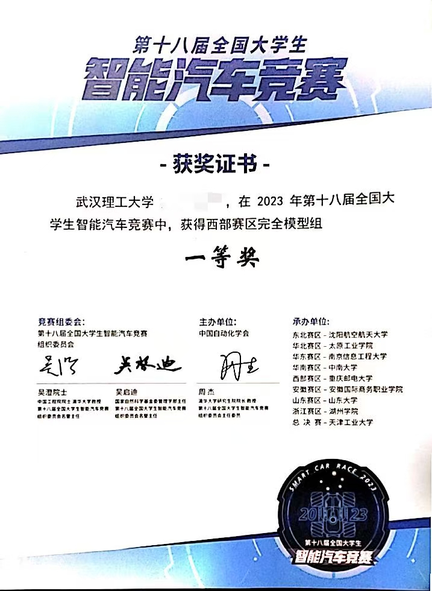
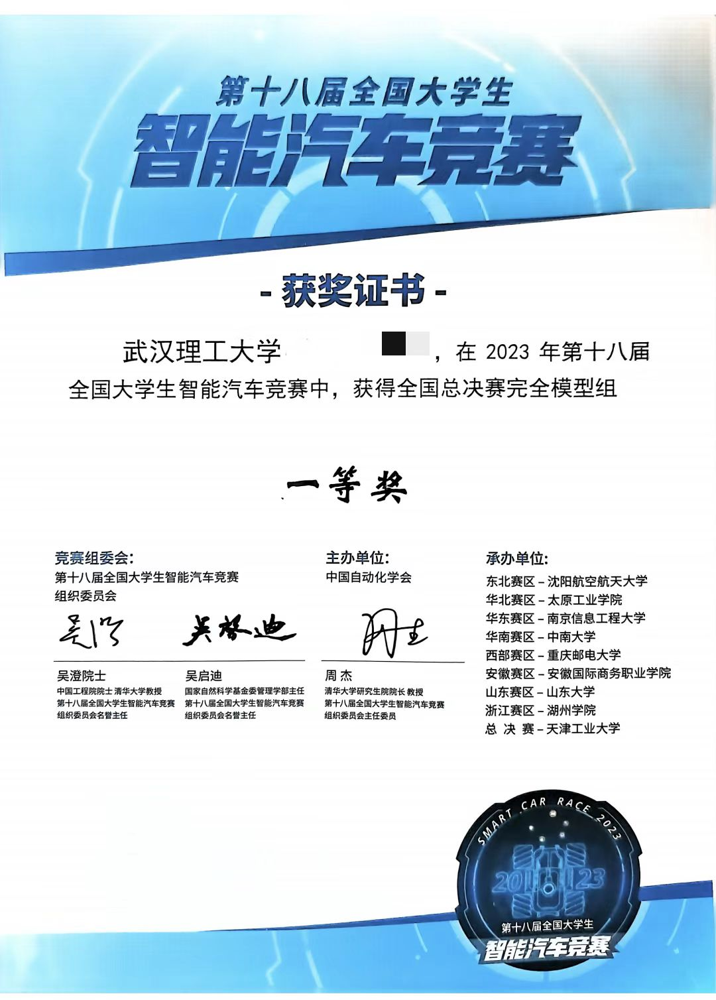

    
    <h1>第十八届全国大学生智能汽车竞赛完全模型组——武汉理工大学花海队</h1>
    

        
        
    

    

        <b>简体中文 | <a href="README_en.md">English</b></a>
    

## 1. 成绩
&emsp;&emsp;校赛（第二名） -> 西部赛区（第一名） -> 国赛（第十四名 - 全国一等奖）
<table>
    <tr>
        <td >
pic.1  省赛 
</td>
        <td >
pic.2  国赛
</td>
    </tr>
</table>

## 2. 相关工作
### 2.1 使用平台
- MCU芯片：英飞凌的tc264芯片
- IDE：AURIX Development Studio；使用了逐飞提供的英飞凌tc264开源库，以减轻开发难度
- 边缘计算板：百度edgeboard开发板，Linux系统

### 2.2 文件结构
&emsp;&emsp;Code_TC264_CarDrive：下位机TC264代码工程 
&emsp;&emsp;Code_Edgeboard：edgeboard代码工程（[队友edgeboard上位机的工作](https://github.com/p-xiexin/icar-pd)）

### 2.3 相关跑车视频
&emsp;&emsp;[西部赛区比赛视频](https://www.bilibili.com/video/BV1c14y1R7UY/?spm_id_from=333.999.0.0&vd_source=9805319fbcc667bd39b66994068b0d17) 
&emsp;&emsp;[断路区测试](https://www.bilibili.com/video/BV1Zp4y1V79A/?spm_id_from=333.999.0.0&vd_source=9805319fbcc667bd39b66994068b0d17) 
&emsp;&emsp;[国赛前夕实验室测试](https://www.bilibili.com/video/BV1LF411y7X6/?spm_id_from=333.999.0.0&vd_source=9805319fbcc667bd39b66994068b0d17) 
&emsp;&emsp;[第一视角](https://www.bilibili.com/video/BV1ep421R7LV/?spm_id_from=333.999.0.0&vd_source=9805319fbcc667bd39b66994068b0d17) 
&emsp;&emsp;[智能车起步初期视频](https://www.bilibili.com/video/BV1DC41147Wu/?spm_id_from=333.999.0.0&vd_source=9805319fbcc667bd39b66994068b0d17) 

## 3. 总结
&emsp;&emsp;硬件有IMU，软件写了相关的姿态解算，但是没有加入方向环到整体的控制结构中，后续可以继续研究。 
&emsp;&emsp;进行了电流环+速度环的代码编写和调试，pid参数来自于上位机发送，可以进行实时的调整而不需要重复的编译下载。（串级闭环调试失败，恢复到了之前的单环控制，将电流环的pid控制器注释了，重新调试只需要启用就可以）然后在输入设定目标速度的地方加入了一阶低通滤波器，存在些许的相位滞后，但是可以避免启动加速度过大对整车机械结构的伤害。 
&emsp;&emsp;在该代码中，存在几个问题；首先，控制上连续s弯道不稳定，这个应该是算法上的问题，需要更换算法结构；由于比赛前，前桥出了问题，导致比赛时不得不降低速度，从而导致参数不太匹配，疯狂撞锥桶。不然我们预计最好成绩可以达到58s，拿到全国第二的成绩，但是这也说明我们的鲁棒性不太好，还有很大的提升空间。 
&emsp;&emsp;对于这个组别的解决方案来说，个人认为如果想学习和深入，可以考虑对滚动时域的模型预测控制器进行尝试；或者使用强化学习进行端到端的控制，即输入端为图像，输出端为控制量电机和舵机.....（纯属个人想法，如果有兴趣想做的可以联系，带我也尝试一下，哈哈哈） 
&emsp;&emsp;**最后，如果觉得我们的这些工作对您有用，可以点点star哦！** 

## 4. 参考
[1] 队友上位机工作：https://github.com/p-xiexin/icar-pd 
[2] 第十七届完模，湖北工业大学蓝电队开源：https://gitee.com/xinnz/landian-yyds 
[3] 北京赛曙科技有限公司/（2023年）智能汽车竞赛-完全模型组-学习资料：https://gitee.com/bjsstech/sasu-intelligentcar-kits
