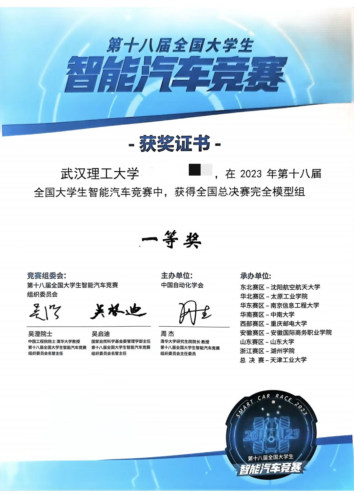

	
	<h1>The complete model group of the 18th National College Students Intelligent Car Competition -- Huahai Team of Wuhan University of Technology</h1>
    

        
        
    

	

		<b><a href="README.md">简体中文</a> | English</b>
	

## 1. result
&emsp;&emsp;School Competition (2nd place) -> Western Competition (1st Place) -> National Competition (14th place - First Prize)
<table>
    <tr>
        <td >
pic.1  provincial competition 
</td>
        <td >
pic.2  National championship
</td>
    </tr>
</table>

## 2. related work
### 2.1 Use platform
- MCU chip: Infineon's tc264 chip
- IDE: AURIX Development Studio; Infineon tc264 open source library is used to reduce the difficulty of development
- Edge computing board: Baidu edgeboard development board, Linux system

### 2.2 file structure
&emsp; &emsp; Code_TC264_CarDrive: Lower machine TC264 code project  
&emsp; &emsp; Code_Edgeboard: edgeboard code engineering ([teammate edgeboard work](https://github.com/p-xiexin/icar-pd))

### 2.3 Related car motion video
&emsp;&emsp;[Western Division game video](https://www.bilibili.com/video/BV1c14y1R7UY/?spm_id_from=333.999.0.0&vd_source=9805319fbcc667bd39b66994068b0d17) 
&emsp;&emsp;[Open zone test](https://www.bilibili.com/video/BV1Zp4y1V79A/?spm_id_from=333.999.0.0&vd_source=9805319fbcc667bd39b66994068b0d17) 
&emsp;&emsp;[Laboratory tests on the eve of national competition](https://www.bilibili.com/video/BV1LF411y7X6/?spm_id_from=333.999.0.0&vd_source=9805319fbcc667bd39b66994068b0d17) 
&emsp;&emsp;[the first perspective](https://www.bilibili.com/video/BV1ep421R7LV/?spm_id_from=333.999.0.0&vd_source=9805319fbcc667bd39b66994068b0d17) 
&emsp;&emsp;[Smart car early start video](https://www.bilibili.com/video/BV1DC41147Wu/?spm_id_from=333.999.0.0&vd_source=9805319fbcc667bd39b66994068b0d17) 

## 3. conclusion
&emsp; &emsp; The hardware has IMU, and the software has written the relevant attitude solution, but the direction loop is not added to the overall control structure, and the subsequent research can be continued.  
&emsp; &emsp; The code of current loop + speed loop is written and debugged. pid parameters are sent from the host computer, which can be adjusted in real time without repeated compilation and download. (The cascade closed-loop debugging failed, restored to the previous single-loop control, the pid controller of the current loop was commented, and the re-debugging only needs to be enabled) and then added a first-order low-pass filter to the place where the input set the target speed, there is a little phase lag, but it can avoid the damage to the mechanical structure of the vehicle if the startup acceleration is too large.  
&emsp; &emsp; In this code, there are several problems; First of all, the continuous S-bend on the control is unstable, which should be an algorithm problem, and the algorithm structure needs to be replaced. Because there was a problem with the front bridge before the game, the speed had to be reduced during the game, which resulted in the parameters not matching well and crazy bumping the cone barrel. Otherwise, we expect the best result to reach 58s, the second in the country, but this also shows that our robustness is not very good, and there is still a lot of room for improvement.  
&emsp; &emsp; For this group of solutions, I think if you want to learn and deepen, you can consider trying the model prediction controller in the rolling time domain. Or use reinforcement learning for end-to-end control, that is, the input end is the image, and the output end is the control motor and steering gear..... (Purely personal idea, if you are interested in what you want to do can contact, take me to try, hhh)  
&emsp; &emsp; **Finally, if you find our work useful to you, you can click star!** 

## 4. reference
[1] teammate edgeboard work: https://github.com/p-xiexin/icar-pd 
[2] The 17th completed model, Hubei University of Technology blue electric team open source: https://gitee.com/xinnz/landian-yyds 
[3] Beijing Saishu Technology Co., LTD. / (2023) Intelligent Car Competition - Complete model Group - Learning materials: https://gitee.com/bjsstech/sasu-intelligentcar-kits
